<div align="center">

# ⚛︎ Fission

### Splitting files at ridiculous speed.

**A fast, modern BitTorrent client with a real-time web UI.**<br>
Industrial-strength C++ engine. Zero-build frontend. No npm. No Electron. No nonsense.

<br>

[](https://libtorrent.org)
[](https://python.org)
[](#-quick-start)
[](https://www.bittorrent.org/beps/bep_0052.html)
[](#-license)

<br>

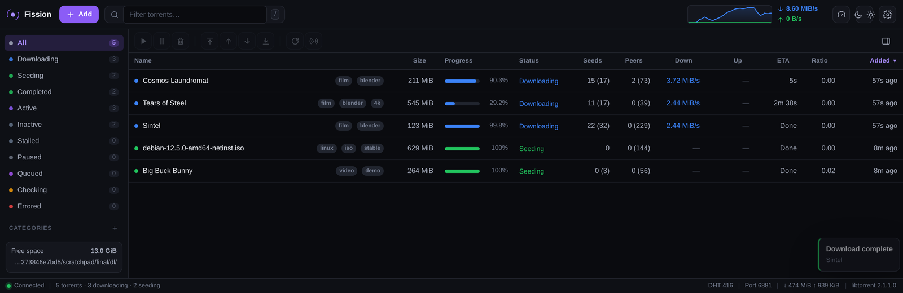

</div>

---

## ⚡ The pitch

Most torrent clients make you pick a lane: a **fast engine** wrapped in a UI from 2009, or a **pretty UI** bolted onto a half-finished protocol implementation that stalls at 40%.

Fission refuses the trade.

> **The engine is libtorrent 2.x** — the same C++ core that powers qBittorrent and Deluge. Two decades of protocol edge cases, already solved.
>
> **The interface is plain ES modules.** No React. No bundler. No `node_modules`. Open a file, edit it, hit refresh. It loads instantly because there is nothing to load.

The daemon pushes state over a WebSocket once a second. The UI never polls. Nothing is optimistically faked, so what you see **is** what the engine thinks — never a spinner lying to you about a torrent that died four minutes ago.

<br>

## 📊 Receipts

Not aspirations. Actual numbers from the test runs that shipped this code:

| Measured | Result |
|---|---|
| 🚀 **Single torrent** | 276 MB pulled at **7.9 MB/s**, complete → seeding, no babysitting |
| 🔥 **Concurrent** | 5 torrents, **10.7 MB/s** combined, 52 peers, 416 DHT nodes |
| 💾 **Restart** | Progress, categories, tags, flags — all restored, **zero re-check** |
| 🧊 **Cold start** | Magnet → metadata from DHT in **under 3 seconds** |
| 📦 **New dependencies** | **Zero.** libtorrent + aiohttp are already on most systems |
| 🧪 **Console errors** | **None**, across every dialog, tab, theme and viewport |

<br>

## ✨ What's in the box

<table>
<tr><td width="33%" valign="top">

### 🌐 Protocol

- BitTorrent **v1 + v2** + hybrid
- DHT, PeX, LSD, µTP
- UPnP / NAT-PMP
- Protocol encryption
- SOCKS4/5 + HTTP proxy
- DNS-through-proxy

</td><td width="33%" valign="top">

### 🎛 Control

- Selective download, file tree
- 4 priority levels
- Sequential + super-seeding
- Per-torrent limits
- Queue, categories, tags
- Ratio & seed-time rules

</td><td width="33%" valign="top">

### 💅 Interface

- Live WebSocket push
- Command palette `⌘K`
- Piece map + speed charts
- **8 themes**, 7 accents
- 3 density levels
- Works at phone width

</td></tr>
</table>

<br>

## 📸 Look at it

<div align="center">

**Detail panel** — general, files, peers, trackers, piece map, charts

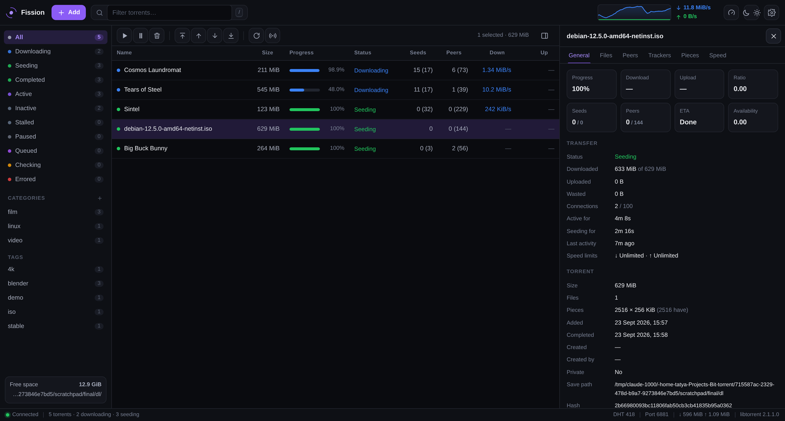

</div>

<details>
<summary><b>🎨 More screenshots</b> — light theme, command palette, piece map, files, settings, loading, mobile</summary>

<br>
<div align="center">

**Light theme** — because some of you open the curtains

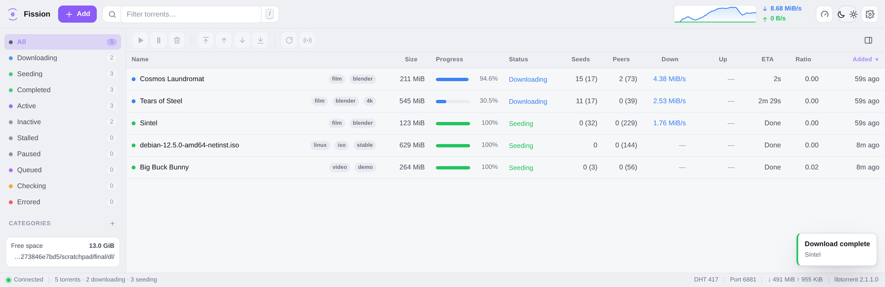

**Command palette** (`⌘K` / `Ctrl K`) — everything, one keystroke away


**Piece map** — watch it fill in real time

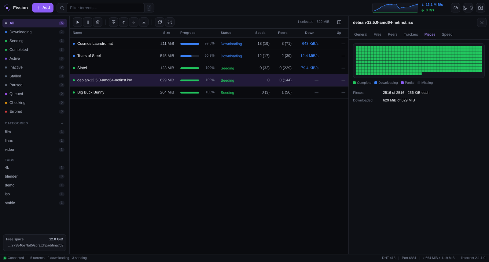

**File tree** — take the episodes you want, skip the rest

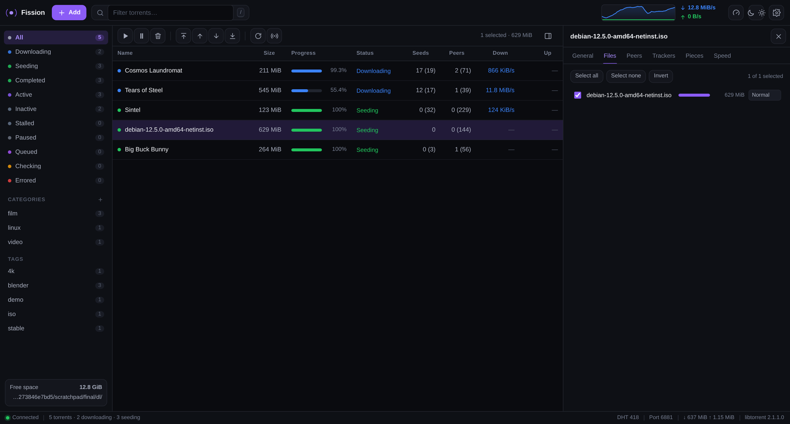

**Settings** — every knob libtorrent has, none of the ones it doesn't

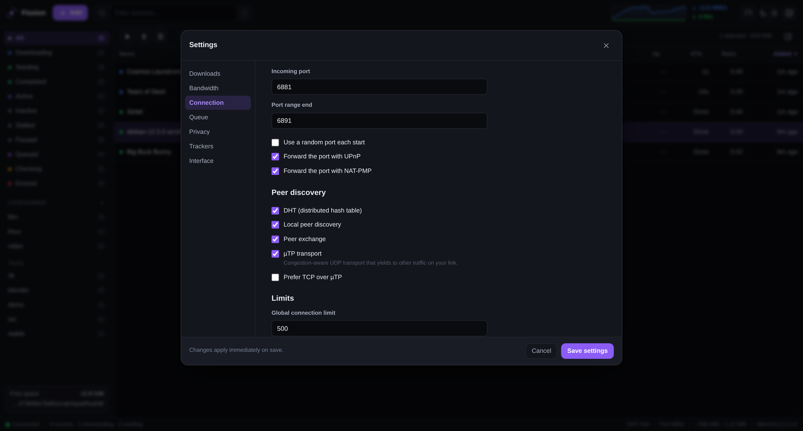

**Loading** — skeleton rows, shown only when data is genuinely late

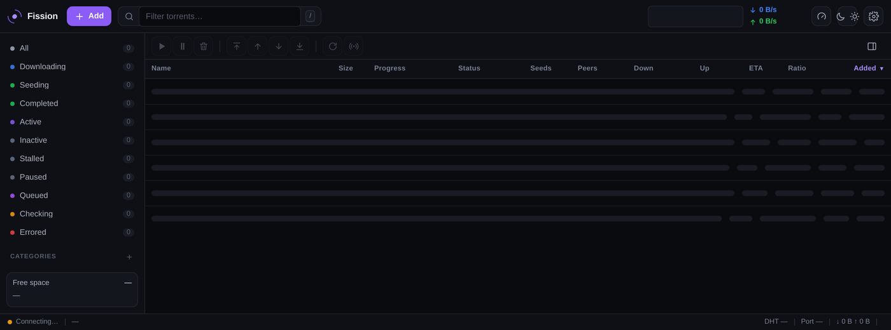

**Phone width** — the whole thing, responsive

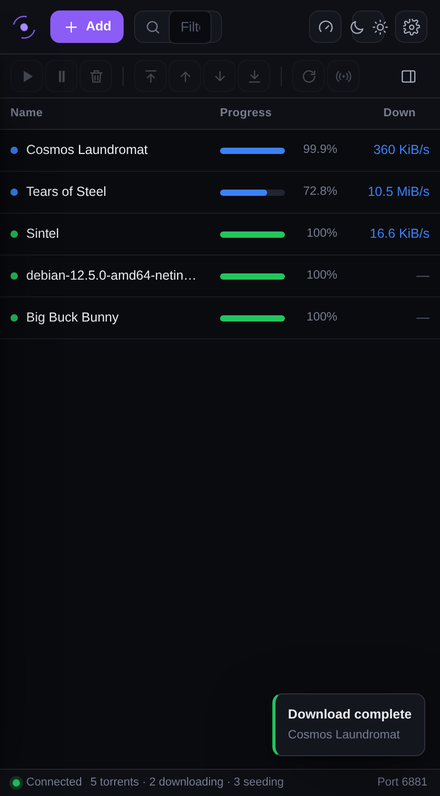

</div>
</details>

<br>

## 🎨 Make it yours

Appearance is **three independent axes**, each switchable instantly — no reload,
no flash of the wrong colours:

<div align="center">

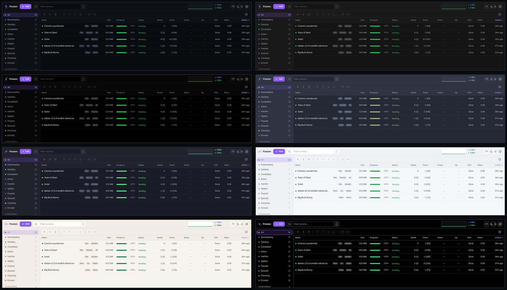

<sub>Midnight · Graphite · Carbon · Nord · Dracula · Paper · Sandstone · Contrast</sub>

</div>

| Axis | Options |
|---|---|
| **Theme** | `System` follows your OS · five dark · two light · one WCAG-AAA `Contrast` |
| **Accent** | Violet, blue, teal, green, amber, rose, cyan — independent of the theme |
| **Density** | `Compact` / `Cozy` / `Comfortable` — drives row height *and* the type scale |
| **Motion** | `Match system` / `Full` / `Reduced` — honours `prefers-reduced-motion` |

Hit the theme button in the toolbar for a quick switch, or open **Settings →
Appearance** for the full picker with live preview and revert-on-cancel.

<div align="center">

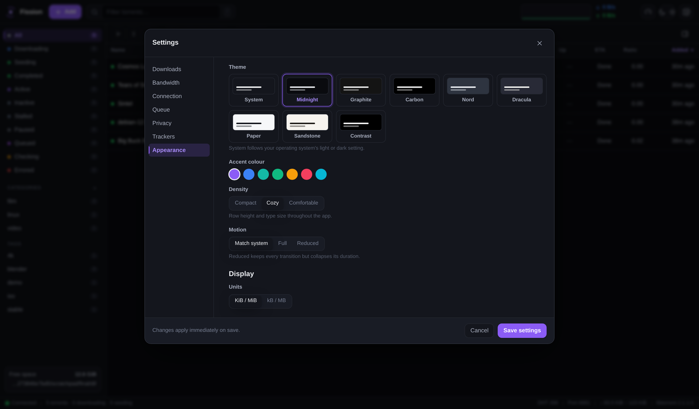

</div>

Under the hood every colour, size, duration and type step is a CSS custom
property in `theme.css`. A component rule never names a colour — which is why a
new theme is a 25-line block rather than an audit of the whole stylesheet.

**Motion earns its place.** Rows animate when *you* re-sort or filter, never on
the once-a-second refresh — otherwise the table would be permanently in motion.
The loading skeleton only appears if data is genuinely late (160 ms), because a
placeholder that flashes for one frame reads as a glitch, not as feedback. Set
Motion to `Reduced` and every duration collapses to ~0 while the layout stays
byte-identical.

<br>

## 🚀 Quick start

```bash
git clone https://github.com/SharvikS/Bit-torrent.git
cd Bit-torrent
./fission.sh --open
```

That's it. It opens at **http://localhost:8080**.

<details>
<summary><b>Need the dependencies?</b></summary>

<br>

Fission needs **Python 3.10+**, **libtorrent 2.x** and **aiohttp**. libtorrent is a compiled
extension, so your distro's package is the smoothest path:

| Platform | Command |
| --- | --- |
| **Arch / CachyOS** | `sudo pacman -S libtorrent-rasterbar python-aiohttp` |
| **Debian / Ubuntu** | `sudo apt install python3-libtorrent python3-aiohttp` |
| **Fedora** | `sudo dnf install rb_libtorrent-python3 python3-aiohttp` |
| **macOS** | `brew install libtorrent-rasterbar && pip install aiohttp` |
| **Anywhere** | `pip install libtorrent aiohttp` |

Prefer it on your `PATH`?

```bash
pip install -e .
fission --open
```

> ⚠️ Using a virtualenv? Create it with `--system-site-packages` so it can see a
> distro-provided libtorrent.

</details>

<br>

## ⌨️ Keys

Built for people who'd rather not touch the mouse.

| Key | Does | Key | Does |
|---|---|---|---|
| `⌘K` | Command palette | `Space` | Pause / resume |
| `N` | Add torrent | `Del` | Remove |
| `/` | Search | `↑ ↓` `J K` | Navigate |
| `I` | Details panel | `⇧ ↑ ↓` | Extend selection |
| `T` | Turtle mode | `⌘A` | Select all |
| `,` | Settings | `?` | Show all shortcuts |

**Paste a magnet link anywhere** and the add dialog opens, pre-filled. Drop a `.torrent` file
anywhere on the window and it just starts. Drag the details panel's edge to resize it —
double-click the handle to snap it back.

<br>

## 🧠 How it works

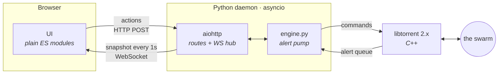

**State flows one way.** The engine pumps libtorrent's alert queue on a short timer inside the
asyncio loop, so every mutation of Fission's bookkeeping is single-threaded — an entire class of
race condition simply doesn't exist here.

**One source of truth.** Anything libtorrent models is read back from `torrent_status`. The few
things it doesn't — categories, tags, when *you* added a torrent — live in a sidecar `meta.json`
keyed by info hash. Nothing drifts across a restart.

```
fission/
  __main__.py   CLI, startup, graceful shutdown
  config.py     typed settings, atomic writes
  engine.py     libtorrent session, alert pump, torrent ops
  api.py        routes, WebSocket hub, auth + request guards
web/
  app.js        state, table, detail panel, dialogs, shortcuts
  theme.css     design tokens — themes, density, motion, type scale
  app.css       components
  net.js        self-healing WebSocket
  ui.js         toasts, modals, context menus
  format.js     bytes, rates, durations
```

<br>

## 🔌 API

Everything the UI can do, `curl` can do.

```bash
curl -X POST localhost:8080/api/add \
  -H 'Content-Type: application/json' \
  -d '{"urls":"magnet:?xt=urn:btih:…","category":"linux","tags":"iso"}'
```

<details>
<summary><b>Full endpoint reference</b></summary>

<br>

| Method | Path | Purpose |
| --- | --- | --- |
| `GET` | `/api/state` | Full snapshot: torrents, stats, categories, tags |
| `GET` | `/api/ws` | WebSocket: snapshots, live detail, events |
| `POST` | `/api/add` | Add magnets / info hashes |
| `POST` | `/api/upload` | Add `.torrent` files (multipart) |
| `POST` | `/api/action` | Bulk actions |
| `GET` | `/api/torrents/{hash}` | Detail: files, peers, trackers, pieces |
| `GET` | `/api/torrents/{hash}/file` | Download the `.torrent` |
| `POST` | `/api/torrents/{hash}/files` | Set file priorities |
| `POST` | `/api/torrents/{hash}/trackers` | Add / remove trackers |
| `GET` `POST` | `/api/settings` | Read / update settings |
| `POST` | `/api/alt-speed` | Toggle alternative limits |

`/api/action` takes `{"action": …, "hashes": [...]}`, where `hashes` may be `["*"]` for everything.

**Actions:** `pause` · `resume` · `force_start` · `recheck` · `reannounce` · `scrape` · `remove` ·
`queue` · `set_limits` · `set_connection_limits` · `set_flag` · `set_category` · `set_tags` ·
`move` · `rename`

</details>

<br>

## 🔒 Before you expose it

Fission binds to **loopback with no password** by default — correct for a personal machine,
wrong for anything else. Going wider? Three things:

1. **Set a password** → `fission --password 'something-long'`
2. **Bind deliberately** → `--host 0.0.0.0` only if you actually mean it
3. **Put TLS in front** → Caddy, nginx, Traefik. Then tell Fission the public hostname:
   ```bash
   FISSION_ALLOWED_HOSTS=torrents.example.com fission --password …
   ```

On loopback, Fission pins the `Host` header and rejects cross-origin state changes — so a random
web page you visit **can't** drive your torrent daemon through your own browser. That guard has to
relax on a wildcard bind, which is exactly why the password matters there.

<details>
<summary><b>Run it as a service</b></summary>

<br>

`packaging/fission.service` is a hardened systemd **user** unit:

```bash
mkdir -p ~/.config/systemd/user
cp packaging/fission.service ~/.config/systemd/user/
# point WorkingDirectory at your checkout, then:
systemctl --user daemon-reload
systemctl --user enable --now fission
```

It allows 30 seconds to stop. Fission spends them telling trackers it's leaving and flushing
resume data — which is precisely what saves you a full hash re-check next time.

</details>

<details>
<summary><b>All CLI flags</b></summary>

<br>

| Flag | Meaning |
| --- | --- |
| `--host` | Interface to bind. Default `127.0.0.1`. |
| `--port` | Web UI port. Default `8080`. |
| `--state-dir` | Settings, resume data, metadata. Default `~/.local/share/fission`. |
| `--download-dir` | Override the default download folder. |
| `--password` | Require a password. Also read from `$FISSION_PASSWORD`. |
| `--open` | Open the UI in your browser on start. |
| `--verbose` | Debug logging. |

Everything else lives in **Settings** in the UI, written to `<state-dir>/config.json`.

</details>

<br>

## ⚖️ Legal

Fission is a BitTorrent client. BitTorrent is a transfer protocol with entirely legitimate uses —
Linux ISOs, scientific datasets, game patches, the Internet Archive, and the Creative Commons
films in the screenshots above. What you move with it is on you. Respect copyright and your local
law.

## 📄 License

MIT. Go wild.

<div align="center">
<br>

**Built with libtorrent, aiohttp, and a stubborn refusal to ship a 400 MB Electron app.**

</div>
